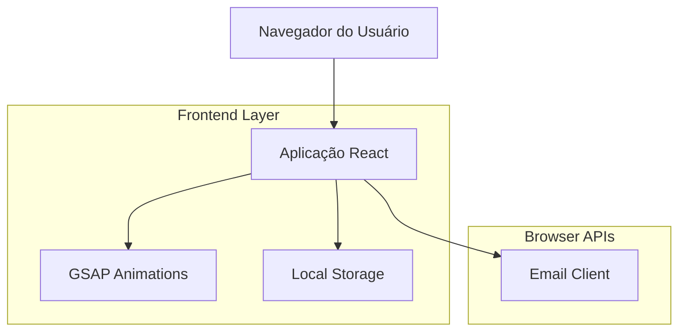

## 1. Arquitetura do Sistema



## 2. Tecnologias Utilizadas

- **Frontend**: React@18 + GSAP@3 + TailwindCSS@3
- **Ferramenta de Inicialização**: vite-init
- **Backend**: None (Aplicação estática)
- **Armazenamento**: LocalStorage para persistência de dados
- **Animações**: GSAP para transições e efeitos visuais

## 3. Definições de Rotas

| Rota | Propósito |
|------|-----------|
| `/` | Página inicial com calendário de agendamento |
| `/confirmacao` | Formulário de confirmação com dados pessoais |
| `/sucesso` | Página de confirmação com senha gerada |

## 4. Estrutura de Dados

### 4.1 Tipos TypeScript

```typescript
interface Agendamento {
  id: string;
  nome: string;
  cpf: string;
  dataNascimento: string;
  email: string;
  telefone: string;
  dataAgendamento: string;
  senha: number;
  horario: string;
}

interface DiaAgendamento {
  data: string;
  vagasDisponiveis: number;
  agendamentos: Agendamento[];
}

interface CalendarioState {
  mesAtual: Date;
  diasDisponiveis: string[];
  agendamentosPorDia: Record<string, number>;
}
```

### 4.2 Armazenamento Local

```typescript
// Estrutura do LocalStorage
const storageKeys = {
  AGENDAMENTOS: 'agendamentos_rg_patrocinio',
  SENHA_ATUAL: 'senha_atual_rg',
  CONFIGURACOES: 'config_sistema_rg'
}

// Formato dos dados armazenados
interface LocalStorageData {
  agendamentos: Agendamento[];
  senhaAtual: number;
  configuracoes: {
    limiteVagasPorDia: number;
    senhaMaxima: number;
    horariosAtendimento: string[];
  }
}
```

## 5. Componentes React

### 5.1 Estrutura de Componentes

```
src/
├── components/
│   ├── Calendario/
│   │   ├── Calendario.tsx
│   │   ├── DiaCalendario.tsx
│   │   └── ContadorVagas.tsx
│   ├── Formulario/
│   │   ├── FormularioAgendamento.tsx
│   │   ├── CampoCPF.tsx
│   │   └── Validacao.tsx
│   ├── Animacoes/
│   │   ├── HeroAnimation.tsx
│   │   ├── TransicaoPagina.tsx
│   │   └── ButtonEffects.tsx
│   └── Layout/
│       ├── Header.tsx
│       ├── Footer.tsx
│       └── Container.tsx
├── hooks/
│   ├── useAgendamentos.ts
│   ├── useCalendario.ts
│   └── useEmail.ts
├── utils/
│   ├── dateUtils.ts
│   ├── validation.ts
│   └── emailTemplate.ts
└── data/
    ├── horarios.ts
    └── instrucoes.ts
```

### 5.2 Lógica de Negócio

```typescript
// Gerenciamento de vagas
class GerenciadorVagas {
  private static LIMITE_VAGAS = 60;
  
  static verificarDisponibilidade(data: string): boolean {
    const agendamentos = this.getAgendamentosPorData(data);
    return agendamentos.length < this.LIMITE_VAGAS;
  }
  
  static getVagasRestantes(data: string): number {
    const agendamentos = this.getAgendamentosPorData(data);
    return this.LIMITE_VAGAS - agendamentos.length;
  }
}

// Geração de senhas
class GeradorSenha {
  private static SENHA_MAXIMA = 100;
  
  static gerarSenha(): number {
    const senhaAtual = this.getSenhaAtual();
    const novaSenha = senhaAtual >= this.SENHA_MAXIMA ? 1 : senhaAtual + 1;
    this.salvarSenhaAtual(novaSenha);
    return novaSenha;
  }
}
```

## 6. Funcionalidades de Email

### 6.1 Template de Email

```typescript
const criarEmailAgendamento = (agendamento: Agendamento): string => {
  const assunto = `Confirmação de Agendamento RG - Patrocínio-MG`;
  const corpo = `
Olá ${agendamento.nome},

Seu agendamento foi confirmado!

📅 Data: ${formatarData(agendamento.dataAgendamento)}
🕐 Horário: ${agendamento.horario}
🎫 Senha: ${agendamento.senha}

📍 Local: Prefeitura Municipal de Patrocínio-MG
[Endereço completo da prefeitura]

📋 Documentos necessários:
- Documento de identidade original
- Certidão de nascimento ou casamento
- Comprovante de residência
- CPF

⏰ Por favor, chegar 15 minutos antes do horário agendado.

Atenciosamente,
Prefeitura Municipal de Patrocínio-MG
  `;
  
  return `mailto:${agendamento.email}?subject=${encodeURIComponent(assunto)}&body=${encodeURIComponent(corpo)}`;
};
```

### 6.2 Implementação do Envio

```typescript
const enviarEmailConfirmacao = (agendamento: Agendamento) => {
  const mailtoLink = criarEmailAgendamento(agendamento);
  window.open(mailtoLink, '_blank');
};
```

## 7. Animações GSAP

### 7.1 Animações de Entrada

```typescript
// Hero animation
useEffect(() => {
  const tl = gsap.timeline();
  tl.from('.hero-title', { duration: 1, y: -50, opacity: 0, ease: 'power3.out' })
    .from('.hero-subtitle', { duration: 0.8, y: -30, opacity: 0, ease: 'power3.out' }, '-=0.5')
    .from('.calendar-container', { duration: 0.8, scale: 0.8, opacity: 0, ease: 'back.out(1.7)' }, '-=0.3');
}, []);

// Calendar day hover effects
const addHoverAnimation = (element: HTMLElement) => {
  element.addEventListener('mouseenter', () => {
    gsap.to(element, { scale: 1.05, duration: 0.2, ease: 'power2.out' });
  });
  
  element.addEventListener('mouseleave', () => {
    gsap.to(element, { scale: 1, duration: 0.2, ease: 'power2.out' });
  });
};
```

## 8. Configurações e Constantes

```typescript
// Configurações do sistema
export const CONFIG = {
  LIMITE_VAGAS_POR_DIA: 60,
  SENHA_MINIMA: 1,
  SENHA_MAXIMA: 100,
  DIAS_ANTECEDENCIA_MINIMA: 1,
  DIAS_ANTECEDENCIA_MAXIMA: 30,
  HORARIOS_ATENDIMENTO: [
    '08:00', '08:30', '09:00', '09:30', '10:00', '10:30',
    '11:00', '11:30', '13:30', '14:00', '14:30', '15:00',
    '15:30', '16:00', '16:30'
  ],
  INFORMACOES_PREFEITURA: {
    nome: 'Prefeitura Municipal de Patrocínio-MG',
    endereco: 'Praça Barão do Patrocínio, 100 - Centro, Patrocínio - MG, 38740-000',
    telefone: '(34) 3831-8600',
    horarioFuncionamento: 'Segunda a Sexta, 08:00 às 17:00'
  }
};
```

## 9. Deploy e Hospedagem

### 9.1 Build Otimizado

```bash
# Build para produção
npm run build

# Otimizações incluídas:
# - Code splitting por rota
# - Compressão de assets
# - Lazy loading de componentes
# - Tree shaking
```

### 9.2 Hospedagem Recomendada

- **Vercel**: Deploy automático a partir do Git
- **Netlify**: Hospedagem gratuita para sites estáticos
- **GitHub Pages**: Integração direta com repositório

### 9.3 Requisitos de Hospedagem

- Suporte para Single Page Applications (SPA)
- HTTPS obrigatório (para funcionalidades de navegador)
- Headers CORS configurados
- Cache de assets estáticos