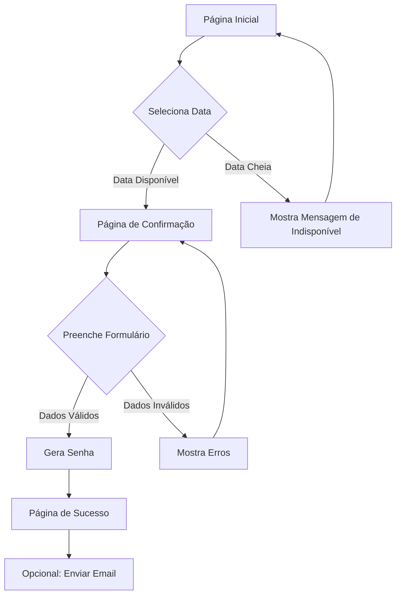

## 1. Visão Geral do Produto

Site de agendamento para emissão de RG na prefeitura de Patrocínio-MG. Sistema simples e intuitivo que permite aos cidadãos marcarem datas disponíveis, com limite de 60 atendimentos por dia e senhas numeradas de 1 a 100.

- **Problema**: Falta de organização no atendimento para emissão de RG
- **Solução**: Sistema de agendamento online com controle de vagas por dia
- **Público-alvo**: Cidadãos de Patrocínio-MG que precisam emitir ou renovar RG

## 2. Funcionalidades Principais

### 2.1 Páginas do Sistema

O sistema de agendamento de RG consiste nas seguintes páginas principais:

1. **Página Inicial**: Apresentação do serviço, calendário de agendamento e informações da prefeitura
2. **Página de Confirmação**: Formulário de dados pessoais e confirmação do agendamento
3. **Página de Sucesso**: Confirmação com detalhes do agendamento e senha

### 2.2 Detalhamento das Funcionalidades

| Página | Módulo | Descrição das Funcionalidades |
|--------|---------|------------------------------|
| Página Inicial | Hero Section | Apresentação visual do serviço com animações GSAP, título "Agendamento de RG - Prefeitura de Patrocínio-MG" |
| Página Inicial | Calendário Interativo | Calendário mensal mostrando dias disponíveis (máx. 60 vagas), dias cheios em vermelho, dias disponíveis em verde |
| Página Inicial | Contador de Vagas | Display mostrando vagas restantes do dia selecionado |
| Página Inicial | Informações Úteis | Endereço, horário de funcionamento, documentos necessários |
| Confirmação | Formulário de Dados | Campos: nome completo, CPF, data de nascimento, email, telefone |
| Confirmação | Validação | Validação de CPF, email e campos obrigatórios |
| Confirmação | Geração de Senha | Sistema automático que atribui próxima senha disponível (1-100) |
| Sucesso | Confirmação | Exibição da senha gerada, data e horário do agendamento |
| Sucesso | Detalhes do Agendamento | Local exato, documentos necessários, orientações |
| Sucesso | Ação Email | Botão "Enviar por Email" que abre cliente de email com dados pré-preenchidos |

## 3. Fluxo de Navegação

### Fluxo Principal do Usuário

1. Usuário acessa a página inicial
2. Visualiza calendário e seleciona data disponível
3. Clica em "Agendar para este dia"
4. Preenche formulário com dados pessoais
5. Sistema valida e gera senha única
6. Exibe página de sucesso com confirmação
7. Usuário pode enviar detalhes por email

## 4. Design da Interface

### 4.1 Estilo Visual

- **Cores Primárias**: Verde municipal (#2E7D32) e branco
- **Cores Secundárias**: Azul claro (#E3F2FD) para backgrounds
- **Botões**: Estilo arredondado com hover effects animados via GSAP
- **Tipografia**: Fonte sans-serif moderna (Roboto ou similar)
- **Tamanhos**: Títulos 32px, texto corpo 16px, botões 18px
- **Animações**: Transições suaves GSAP para elementos ao scrollar
- **Ícones**: Ícones minimalistas em SVG para melhor performance

### 4.2 Design por Página

| Página | Módulo | Elementos de UI |
|--------|---------|----------------|
| Página Inicial | Hero | Background gradiente verde-branco, logo da prefeitura, título animado |
| Página Inicial | Calendário | Grid 7x5, dias clicáveis com hover scale, indicadores visuais de disponibilidade |
| Página Inicial | Contador | Card destacado com número grande de vagas restantes |
| Confirmação | Formulário | Inputs com bordas arredondadas, labels animados, validação em tempo real |
| Confirmação | Botão Finalizar | Botão grande verde com ícone de confirmação |
| Sucesso | Card Confirmação | Card centralizado com ícone de sucesso, senha em destaque |
| Sucesso | Ações | Botões para imprimir e enviar email lado a lado |

### 4.3 Responsividade

- **Desktop-first**: Otimizado para telas grandes (1920x1080)
- **Mobile-adaptativo**: Layout responsivo para tablets e smartphones
- **Touch-friendly**: Botões e calendário otimizados para toque em dispositivos móveis
- **Breakpoints**: Desktop (1200px+), Tablet (768-1199px), Mobile (<768px)